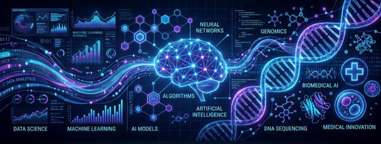

  

   
   

  <h1>Hi there, I'm Andrés 👋</h1>
  
  

    
  

  
  

    I am a <strong>Data Science</strong> student in Colombia focused on analysis and modeling using <b>Machine Learning (ML)</b> and <b>Big Data</b> techniques to reduce uncertainty in decision-making. Additionally, I am pursuing a minor in <strong>HealthTech</strong> with a strong focus on precision medicine and epigenetics.
  

  

    
    
  

   

## 🚀 What I Do

- 🧠 **Machine Learning & Deep Learning:** Development of predictive models using scikit-learn, TensorFlow, and PyTorch.
- ⚙️ **Data Engineering:** Design and implementation of robust ETL pipelines.
- 🗄️ **Database Management:** Structuring and maintaining efficient data storage solutions.
- 📊 **Data Visualization & Dashboards:** Creating interactive insights with Seaborn, Dash, Power BI, and Tableau.
- 🧬 **HealthTech & Genomics:** Applying data analytics to precision medicine, bioinformatics, and epigenetic research.

 

## 🛠️ My Tech Stack

### Languages

  
  
  

### Machine Learning & Data Science

  
  
  
  
  

### Visualization & BI

  
  
  

### Cloud & Databases

  
  
  

 

## 📈 GitHub Stats

  
   
   
  

 

  <i>"In God we trust, all others must bring data."</i> - W. Edwards Deming

